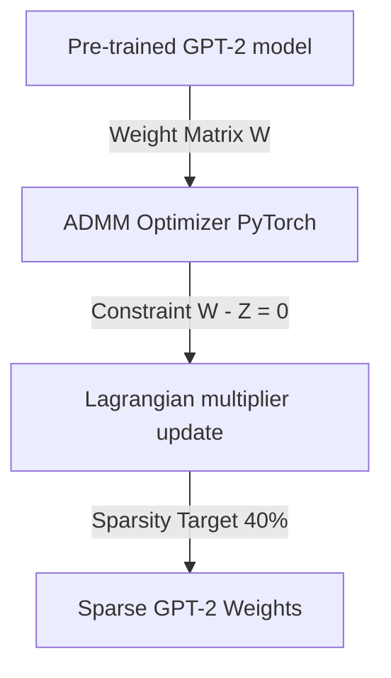

# 📉 GPT-2 Structural Weight Pruning using ADMM Optimization
   

## 📋 Table of Contents
- [Project Overview](#🎯-project-overview)
- [What This Project Does](#🚀-what-this-project-does)
- [Key Innovation](#🔬-key-innovation)
- [Performance Highlights](#📊-performance-highlights)
- [Architecture](#🏗️-architecture)
- [Tech Stack](#🧱-tech-stack)
- [Quick Start](#💻-quick-start)

---

## 🎯 Project Overview
An optimization project implementing weight pruning/sparsity algorithms on GPT-2 models using the Alternating Direction Method of Multipliers (ADMM) framework in PyTorch. Achieved 40% weight sparsity with less than a 1.5% perplexity increase, backed by MATLAB Live Scripts and Simulink state-space models.

---

## 🚀 What This Project Does
* **The Challenge:** Large Language Models (LLMs) like GPT-2 are too large for edge device deployment, but standard heuristic pruning causes significant degradation in text quality (perplexity).
* **Our Solution:** A structured weight pruning pipeline using ADMM to formulate pruning as a constrained optimization problem, retaining GPT-2 accuracy under heavy compression.

---

## 🔬 Key Innovation
| Feature | Heuristic Pruning ❌ | ADMM Pruning ✅ | Benefit |
|---------|---------------------|-----------------|---------|
| **Constraint** | Hard thresholding of small weights | **Mathematical ADMM constraint mapping** | Guarantees convergence to target sparsity |
| **Perplexity** | Sharp drops in accuracy | **Sparsity-aware fine-tuning** | Under 1.5% perplexity degradation |
| **Sparsity** | Unstructured random sparse matrices | **Structured layer weight pruning** | Compresses matrices for faster inference |

---

## 📊 Performance Highlights
- ✅ **40% weight sparsity** achieved on GPT-2 attention blocks.
- ✅ **Under 1.5% perplexity drop** on WikiText-2 datasets.
- ✅ **State-space simulations** modeled using MATLAB and Simulink.

---

## 🏗️ Architecture


---

## 🧱 Tech Stack
- PyTorch for GPT-2 attention layer pruning and weight masking
- MATLAB Live Scripts for convergence optimization calculations
- Simulink for structural modeling

---

## 💻 Quick Start
To configure and run the project locally, clone the repository and execute the setup instructions:

```bash
git clone https://github.com/Raghuram-sekar/GPT2-ADMM-Pruning.git
cd GPT2-ADMM-Pruning

# Execute local setup commands:
# ADMM Optimization Formulation:
# min_W f(W) + g(Z) subject to W - Z = 0
# L_rho(W, Z, U) = f(W) + g(Z) + (rho/2)*||W - Z + U||_2^2 - (rho/2)*||U||_2^2

jupyter notebook GPT2_ADMM_Pruning_Implementation.ipynb
```
