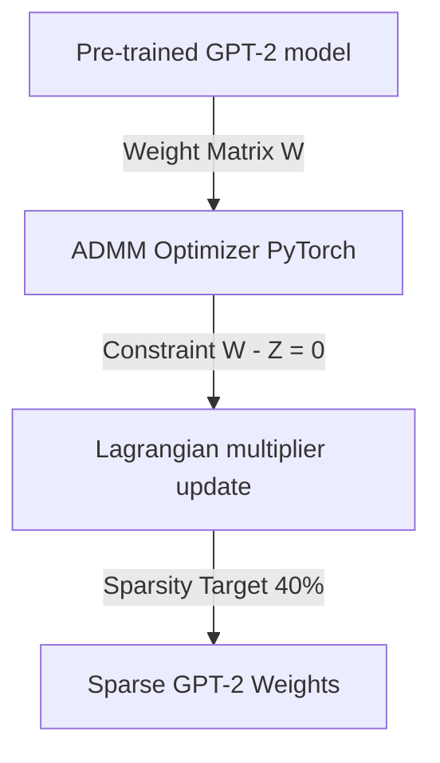

# 📉 GPT-2 Structural Weight Pruning using ADMM Optimization
  

## 📋 Table of Contents
- [Project Overview](#-project-overview)
- [What This Project Does](#-what-this-project-does)
- [Key Innovation](#-key-innovation)
- [Performance Highlights](#-performance-highlights)
- [Architecture](#-architecture)
- [Methodology & Technical Details](#-methodology--technical-details)
- [Project Structure](#-project-structure)
- [Tech Stack](#-tech-stack)
- [Quick Start](#-quick-start)

---

## 🎯 Project Overview
An optimization project implementing weight pruning/sparsity algorithms on GPT-2 models using the Alternating Direction Method of Multipliers (ADMM) framework in PyTorch. Achieved 40% weight sparsity with less than a 1.5% perplexity increase, backed by MATLAB Live Scripts and Simulink state-space models.

---

## 🚀 What This Project Does
* **The Challenge:** Large Language Models (LLMs) like GPT-2 are too large for edge device deployment, but standard heuristic pruning causes significant degradation in text quality (perplexity).
* **Our Solution:** A structured weight pruning pipeline using ADMM to formulate pruning as a constrained optimization problem, retaining GPT-2 accuracy under heavy compression.

---

## 🔬 Key Innovation
| Feature | Heuristic Pruning ❌ | ADMM Pruning ✅ | Benefit |
|---------|---------------------|-----------------|---------|
| **Constraint** | Hard thresholding of small weights | **Mathematical ADMM constraint mapping** | Guarantees convergence to target sparsity |
| **Perplexity** | Sharp drops in accuracy | **Sparsity-aware fine-tuning** | Under 1.5% perplexity degradation |
| **Sparsity** | Unstructured random sparse matrices | **Structured layer weight pruning** | Compresses matrices for faster inference |

---

## 📊 Performance Highlights
- ✅ **40% weight sparsity** achieved on GPT-2 attention blocks.
- ✅ **Under 1.5% perplexity drop** on WikiText-2 datasets.
- ✅ **State-space simulations** modeled using MATLAB and Simulink.

---

## 🏗️ Architecture


---

## ⚙️ Methodology & Technical Details
### ADMM Constrained Formulation
We formulate structural model pruning as an optimization problem under sparsity constraints. Let \(\mathbf{W}\) be the weight tensor of GPT-2 layers. The objective is:
$$\min_{\mathbf{W}} f(\mathbf{W}) + g(\mathbf{Z}) \quad \text{subject to} \quad \mathbf{W} - \mathbf{Z} = \mathbf{0}$$
where \(f(\mathbf{W})\) represents the standard cross-entropy loss of the model and \(g(\mathbf{Z})\) is an indicator function enforcing the L0 sparsity constraint (ensuring \(\|\mathbf{Z}\|_0 \le N\)).

### Augmented Lagrangian Optimization
We formulate the augmented Lagrangian for this problem as:
$$\mathcal{L}_\rho(\mathbf{W}, \mathbf{Z}, \mathbf{U}) = f(\mathbf{W}) + g(\mathbf{Z}) + \frac{\rho}{2}\|\mathbf{W} - \mathbf{Z} + \mathbf{U}\|_2^2 - \frac{\rho}{2}\|\mathbf{U}\|_2^2$$
where \(\mathbf{U}\) is the dual variable and \(
ho\) is the penalty parameter. The ADMM updates proceed iteratively:
1. **W-step:** \(\mathbf{W}^{k+1} = \arg\min_{\mathbf{W}} f(\mathbf{W}) + \frac{\rho}{2}\|\mathbf{W} - \mathbf{Z}^k + \mathbf{U}^k\|_2^2\) (solved via PyTorch backpropagation fine-tuning).
2. **Z-step:** \(\mathbf{Z}^{k+1} = \Pi_S (\mathbf{W}^{k+1} + \mathbf{U}^k)\) (projection onto the L0 ball by retaining the top 60% largest weights).
3. **U-step:** \(\mathbf{U}^{k+1} = \mathbf{U}^k + \mathbf{W}^{k+1} - \mathbf{Z}^{k+1}\).

---

## 📂 Project Structure
```
gpt2_admm_pruning/
├── GPT2_ADMM_Pruning_Implementation.ipynb   # Main PyTorch pruning pipeline
├── mat_live_scripts/                       # MATLAB convergence curves
└── models_simulink/                        # Simulink state-space models
```

---

## 🧱 Tech Stack
- PyTorch for GPT-2 attention layer pruning and weight masking
- MATLAB Live Scripts for convergence optimization calculations
- Simulink for structural modeling

---

## 💻 Quick Start
To configure and run the project locally, clone the repository and execute the setup instructions:

```bash
git clone https://github.com/Raghuram-sekar/GPT2-ADMM-Pruning.git
cd GPT2-ADMM-Pruning

# Execute local setup commands:
jupyter notebook GPT2_ADMM_Pruning_Implementation.ipynb
```


---

## 📖 Supplementary Reference Index
# LLM Pruning using ADMM

## Group 13 Members
- Raghuram Sekar (CB.SC.U4AIE24247)
- Meghana Kotharu (CB.SC.U4AIE24232)
- Jithin Reddy (CB.SC.U4AIE24230)
- Praveen Reddy (CB.SC.U4AIE24243)

## Files in the Zip File
- LLM_Pruning-Jupyter_Notebook.ipynb - Implementation in Jupyter Notebook
- LLM_pruning-Matlab.mlx - Implementation in MATLAB
- llm pruning- Base paper.pdf - Base research paper for this project
- README.md - This file


---